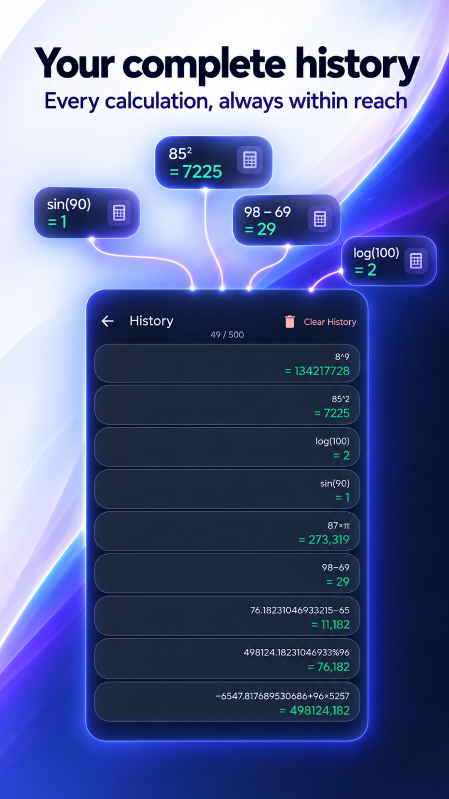
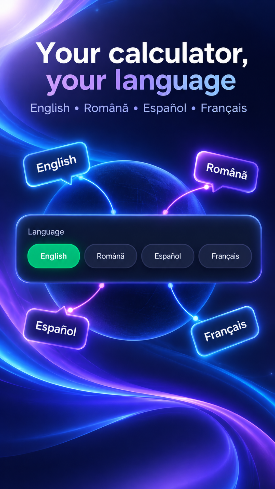
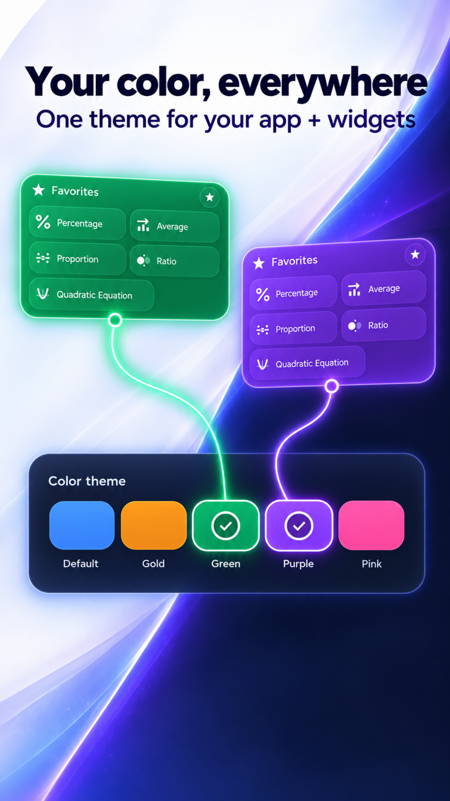
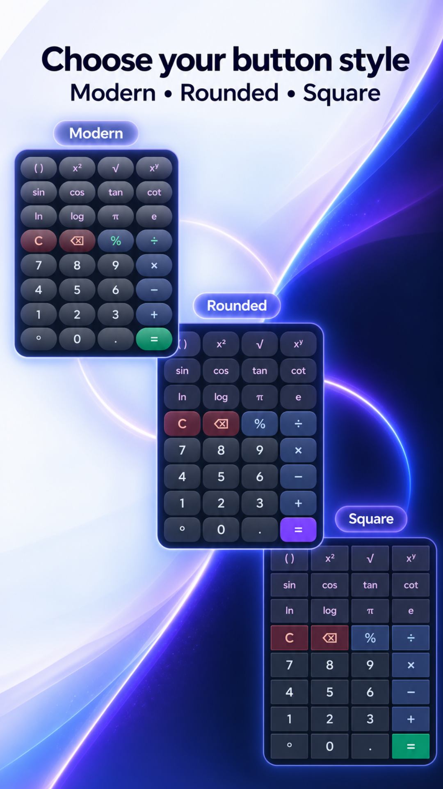

# 🧮 Modern Calculator

### Scientific Calculator + 100+ Tools

**Math, geometry, graphs, converters, finance and more for Android.**
Free. Fast. Built for everyday problem solving.

 

---

---

## 🧮 About Modern Calculator

**Modern Calculator** brings a scientific calculator and **100+ tools** into one polished Android app. It is built for everyday calculations, school, work, finance, geometry, conversions and more.

All core calculations and histories are stored locally on your device. No account is required.

> ### 🔔 Free App — Supported by Advertising
> The free version uses **Google AdMob** advertising.  
> **Remove Ads** is a one-time Google Play purchase that disables advertising features in the app.  
> No subscription. No recurring charge.

---

## ✨ Features

### 🔢 Scientific calculator
- **Basic operations:** `+`, `−`, `×`, `÷`, `%`
- **Scientific functions:** `sin`, `cos`, `tan`, `cot`, `log`, `ln`, roots and factorial
- **Advanced:** `x²`, `xʸ`, `π`, `e`, parentheses and live result preview
- **DEG / RAD** angle modes, ANS memory and copyable results
- **Classic, Rounded and Modern** button styles

### 🧰 100+ tools in one app
- **Algebra:** percentages, equations, systems, matrices, trigonometry, statistics, primes and more
- **2D & 3D Geometry:** shapes, solids, measurements, diagrams, formulas and detailed explanations
- **Function graphs:** linear, quadratic and trigonometric graphs with zoom and pan
- **Unit converters:** length, temperature, weight, speed, data, cooking, energy and more
- **Finance, Health, Date & Time and Other:** currency, loans, tax, BMI, time zones, recipes, electricity and more

### 📜 History, favorites and widgets
- **Local histories** for the calculator and tools
- **100 entries free / 500 with Remove Ads**
- **Tap to reuse** saved results and clear history whenever you want
- **Favorites**, search and a configurable home-screen widget
- **Local backup and restore** for preferences

### 🎨 Built around you
- **Light, Dark, AMOLED and System** themes
- **English, Română, Español and Français**
- Global number format, decimal precision, metric/imperial preferences and a default DEG/RAD setting
- Most tools work offline. Currency conversion requires an internet connection when rates are refreshed.

---

## 💳 Pricing

Modern Calculator is free and ad-supported. The paid option is optional.

| Product | Price | Description |
|---|:---:|---|
| 🚫 **Remove Ads** | Shown by Google Play | **One-time purchase.** Disables advertising features in the app, unlocks up to 500 history entries and can be restored with the same Google Play account. No subscription. |

---

## 🛡️ Privacy

| | |
|---|---|
| ✅ | Calculations, histories and preferences are stored locally |
| ✅ | No Modern Calculator server receives calculation history |
| ✅ | Consent choices are managed through Google UMP where required |
| ✅ | Remove Ads disables advertising features |
| ✅ | No account or registration required |
| ✅ | Payments are processed by Google Play; RevenueCat helps verify and restore purchases |

→ **[Full Privacy Policy](./PRIVACY_POLICY.md)**

---

## 🔗 Download

---

## 🛠️ Technical Details

- **Language:** Kotlin
- **Minimum SDK:** Android 7.0 (API 24)
- **UI:** Material Design 3
- **Ads and consent:** Google Mobile Ads SDK + Google UMP
- **Purchases:** Google Play Billing + RevenueCat

---

## 🤝 Contributing

Contributions are welcome.

- 🐛 [Report bugs](https://bugs.deniscasian.com)
- 💡 [Request features](https://github.com/deniscasian699/Modern-Calculator/issues)
- 🌍 Help translate the app
- 🛠️ Submit pull requests

---

## 📄 Legal & Support

| Document | Description |
|---|---|
| [Privacy Policy](./PRIVACY_POLICY.md) | How the app and third-party services handle data |
| [Terms of Use](./TERMS_OF_SERVICE.md) | Rules for using the app |
| [Changelog](./CHANGELOG.md) | Version history |
| [Support](./SUPPORT.md) | Help and contact |

---

## 👤 Developer

**Denis Casian** — Independent developer, Romania 🇷🇴

| | |
|---|---|
| 🌐 Website | [deniscasian.com](https://deniscasian.com) |
| 📧 Support | [support@deniscasian.com](mailto:support@deniscasian.com) |
| 🐛 Bug Reports | [bugs.deniscasian.com](https://bugs.deniscasian.com) |
| 📱 Google Play | [Modern Calculator](https://play.google.com/store/apps/details?id=ro.studio.moderncalculator) |

---

Made with ❤️ for students, professionals and anyone who needs a reliable calculator.

*© 2026 Modern Calculator.*

