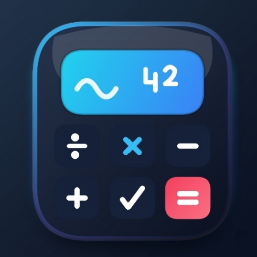
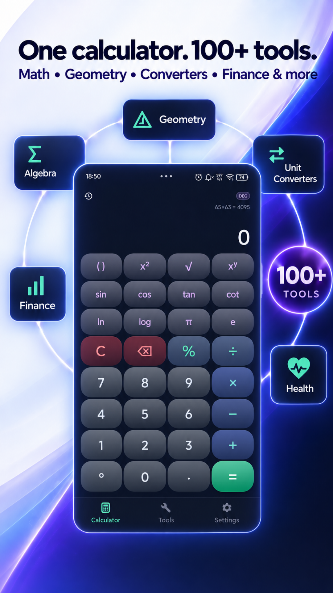
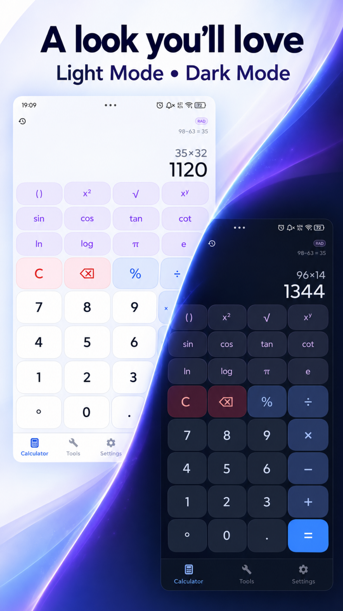
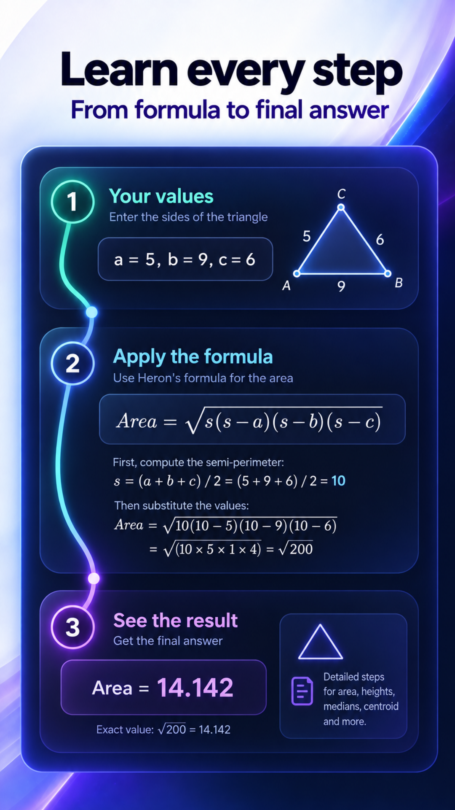
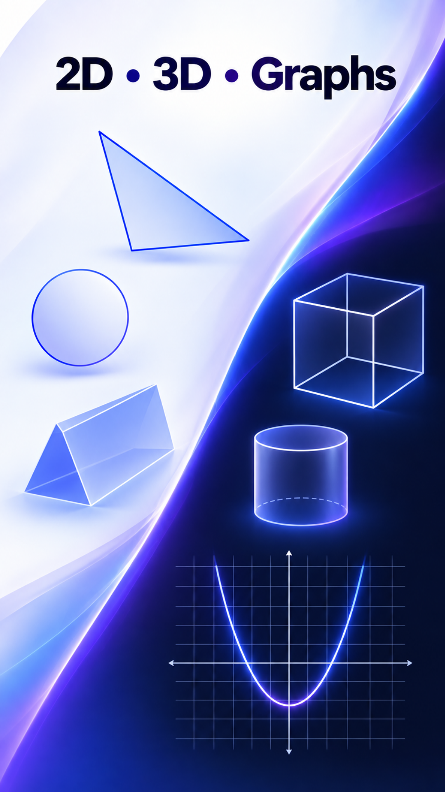

# 🧮 Modern Calculator

### Scientific Calculator with History & Functions

**Clean, powerful calculator for Android.**
Free. Fast. Open Source.

 

---

---

## 🧮 About Modern Calculator

**Modern Calculator** is a clean, powerful scientific calculator for Android. It provides standard and advanced mathematical functions, calculation history, live result preview, and DEG/RAD angle mode switching — all in a fast and elegant interface optimized for any screen size.

All calculations are performed **100% locally** on your device. Your calculation history never leaves your phone.

> ### 🔔 Free App — Supported by Advertising
> Modern Calculator is free and funded by **Google AdMob** advertising.
> **Remove Ads** (one-time purchase) permanently disables all advertising.
> No subscriptions. No recurring charges.

---

## ✨ Features

### 🔢 Standard & Scientific Functions
- **Basic operations:** `+`, `−`, `×`, `÷`, `%`
- **Scientific functions:** `sin`, `cos`, `tan`, `cot`, `log`, `ln`, `sqrt`, `cbrt`
- **Advanced:** `x²`, `xʸ`, `!` (factorial), `π`, `e`
- **Parentheses support** with automatic closing
- **Live result preview** as you type
- **DEG / RAD toggle** for angle mode

### 📜 Calculation History
- **Unlimited history** — every calculation is saved locally
- **Tap to reuse** — tap any result to insert it into current expression
- **Clear anytime** — remove all history with one tap
- **100% local** — stored in SharedPreferences, never uploaded

### ⚡ Smart Features
- **ANS memory** — last result automatically available for next calculation
- **Instant evaluation** — full recursive expression parser with correct operator precedence
- **Adaptive UI** — button sizes adjust to any screen, from small phones to tablets
- **Dark theme** — optimized for comfortable use in any lighting
- **Works offline** — no internet connection needed

---

## 💳 Pricing

Modern Calculator is **free** and supported by Google AdMob advertising. The paid tier is optional.

| Product | Price | Description |
|---|:---:|---|
| 🚫 **Remove Ads** | €2.99 | **One-time purchase.** Permanently removes all advertising. AdMob SDK completely disabled — no banner, interstitial, native, or app open ads. No GAID access. Restoreable via Google Play. |

> ❤️ Remove Ads helps keep Modern Calculator actively developed.

---

## 🛡️ Privacy

| | |
|---|---|
| 🔔 | Google AdMob advertising shown to free users |
| ✅ | Remove Ads tier disables AdMob SDK completely |
| ✅ | Calculation history stored **only locally** (max 100 entries) |
| ❌ | No analytics or crash-reporting SDKs |
| ❌ | No advertising ID accessed for premium users |
| ❌ | No user profiling of any kind |
| ❌ | No account or registration required |
| ❌ | No servers — all calculations performed on-device |
| ✅ | Purchases managed by Google Play + RevenueCat (anonymous ID only) |
| ✅ | GDPR, CCPA, and U.S. state privacy law compliant |

→ **[Full Privacy Policy](./PRIVACY_POLICY.md)**

---

## 🔗 Download

---

## 🛠️ Technical Details

- **Language:** Kotlin 100%
- **Minimum SDK:** Android 7.0 (API 24)
- **Target SDK:** Android 14 (API 34)
- **UI:** Material Design 3
- **Expression Parser:** Custom recursive descent parser
- **Ads:** Google AdMob 23.2.0+ (banner, interstitial, app open, native)
- **Billing:** RevenueCat SDK + Google Play Billing
- **Consent:** Google UMP SDK — GDPR & US Privacy compliant

---

## 🤝 Contributing

Contributions are welcome! See [CONTRIBUTING.md](./CONTRIBUTING.md) for details.

- 🐛 [Report bugs](https://github.com/deniscasian699/Modern-Calculator/issues/new?template=bug_report.md)
- 💡 [Request features](https://github.com/deniscasian699/Modern-Calculator/issues/new?template=feature_request.md)
- 🌍 Translate the app
- 🛠️ Submit pull requests

---

## 📄 Legal Documents

| Document | Description |
|---|---|
| [Privacy Policy](./PRIVACY_POLICY.md) | How we handle your data |
| [Terms of Use](./TERMS_OF_SERVICE.md) | Rules for using the app |
| [License](./LICENSE) | Open-source license |
| [Security Policy](./SECURITY.md) | How to report vulnerabilities |
| [Changelog](./CHANGELOG.md) | Version history |
| [Support](./SUPPORT.md) | Help and contact |

---

## 👤 Developer

**Denis Casian** — Independent developer, Romania 🇷🇴

| | |
|---|---|
| 🌐 Website | [deniscasian.com](https://deniscasian.com) |
| 📧 Support | [support@deniscasian.com](mailto:support@deniscasian.com) |
| 🐛 Bug Reports | [bugs.deniscasian.com](https://bugs.deniscasian.com) |
| 📱 Google Play | [Modern Calculator](https://play.google.com/store/apps/details?id=ro.studio.moderncalculator) |

---

Made with ❤️ for students, engineers, and anyone who needs a reliable calculator.

*© 2026 Modern Calculator. Open Source Software.*

