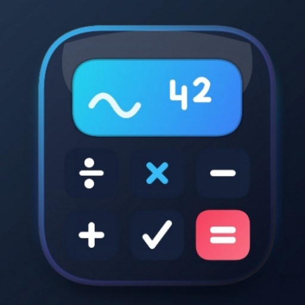
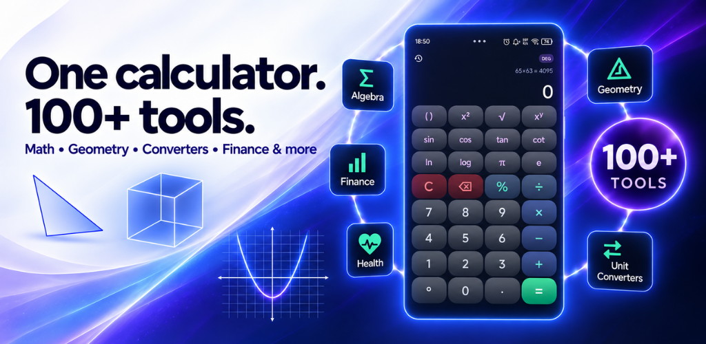
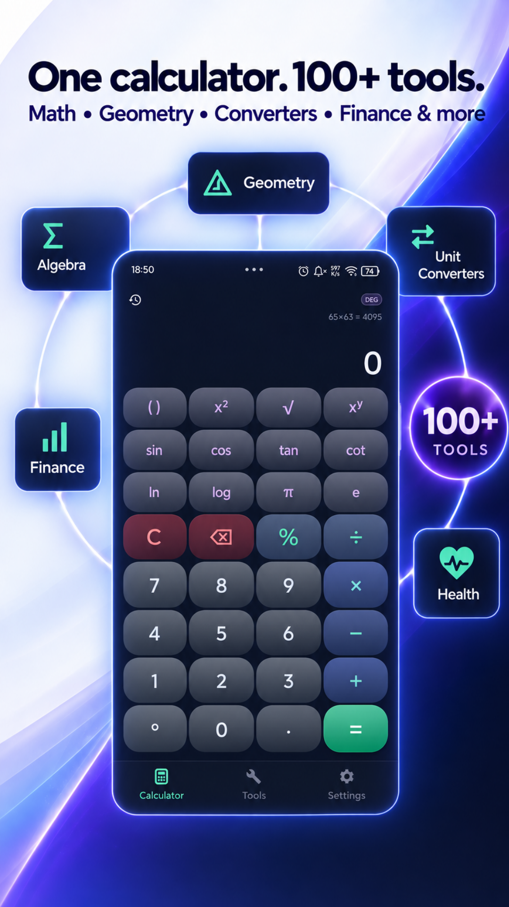
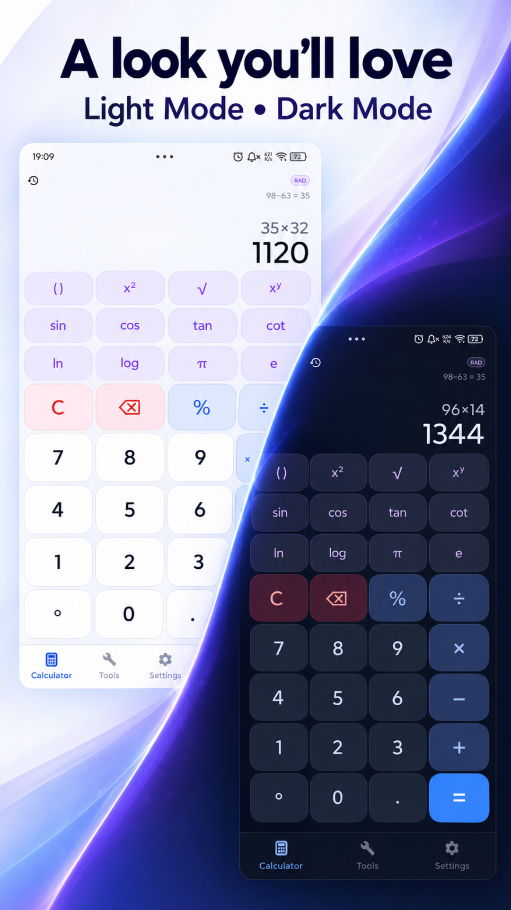
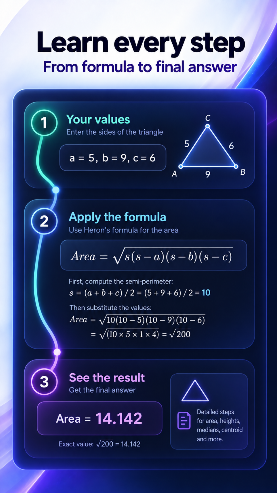
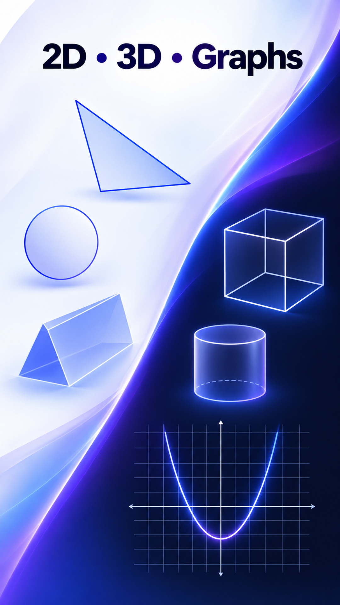
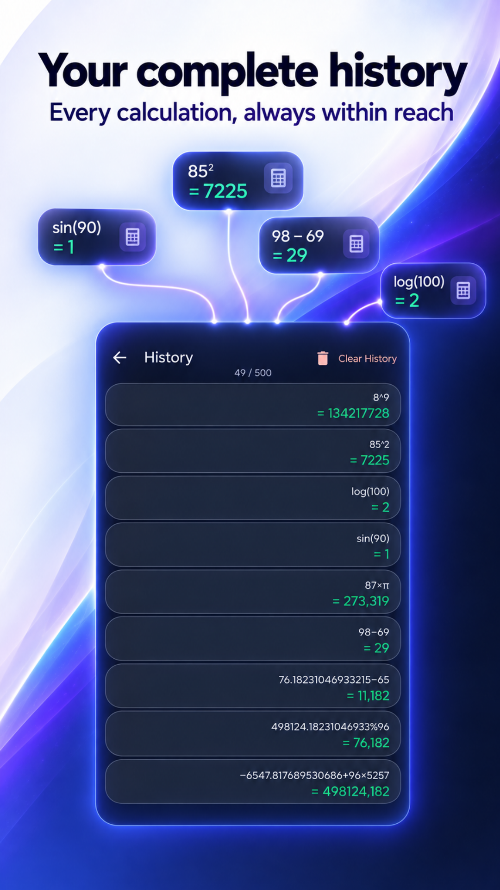
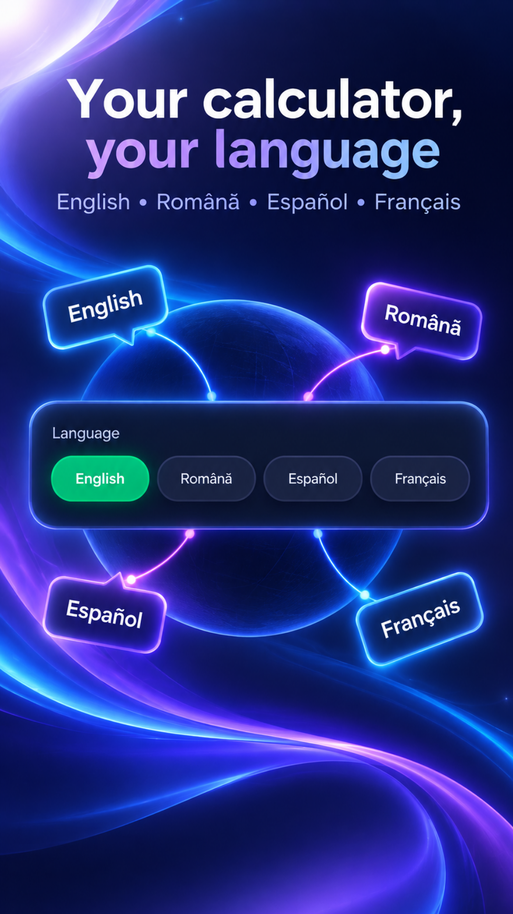
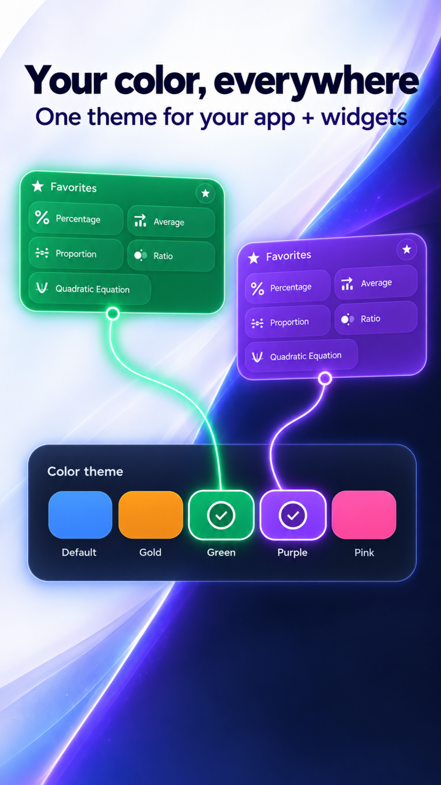
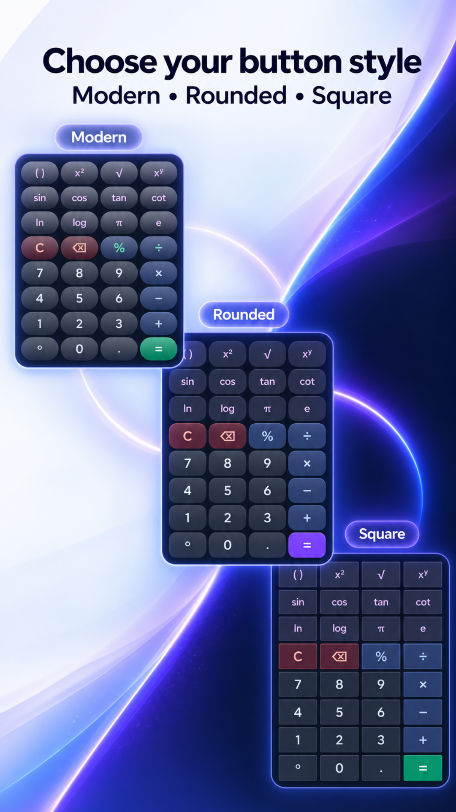

# 🧮 Modern Calculator

### Scientific Calculator + 100+ Tools

**Math, geometry, graphs, converters, finance and more for Android.**
Free. Fast. Built for everyday problem solving.

 

---

---

## 🧮 About Modern Calculator

**Modern Calculator** brings a scientific calculator and **100+ tools** into one polished Android app. It is built for everyday calculations, school, work, finance, geometry, conversions and more.

All core calculations and histories are stored locally on your device. No account is required.

> ### 🔔 Free App — Supported by Advertising
> The free version uses **Google AdMob** advertising.  
> **Premium Monthly** and **Premium Lifetime** unlock extra features, but **ads remain**.  
> To stop ads, choose the separate **Remove Ads** one-time purchase or an active **Supporter Monthly** subscription.

---

## ✨ Features

### 🔢 Scientific calculator
- **Basic operations:** `+`, `−`, `×`, `÷`, `%`
- **Scientific functions:** `sin`, `cos`, `tan`, `cot`, `log`, `ln`, roots and factorial
- **Advanced:** `x²`, `xʸ`, `π`, `e`, parentheses and live result preview
- **DEG / RAD** angle modes, ANS memory and copyable results
- **Classic, Rounded and Modern** button styles
- The `%` key supports both percentages and modulo, depending on the expression

### 🧰 100+ tools in one app
- **Algebra:** percentages, equations, systems, matrices, trigonometry, statistics, primes and more
- **2D & 3D Geometry:** shapes, solids, measurements, diagrams, formulas and detailed explanations
- **Function graphs:** linear, quadratic and trigonometric graphs with zoom and pan
- **Unit converters:** length, temperature, weight, speed, data, cooking, energy and more
- **Finance, Health, Date & Time and Other:** currency, loans, tax, BMI, time zones, recipes, electricity and more
- **Fractions:** add, subtract, multiply, divide and raise fractions to powers
- **Step-by-step explanations** show formulas, substitutions and results for supported tools; Premium removes the explanation limit

### 📜 History, favorites and widgets
- **Local histories** for the calculator and tools
- **Up to 100 history entries by default / 500 with Premium**
- **Tap to reuse** saved results and clear history whenever you want
- **Favorites**, search and a configurable home-screen widget
- **Local backup and restore** for preferences

### 🎨 Built around you
- **Light, Dark, AMOLED and System** themes
- **Default, Gold, Green, Purple and Pink** accent colors
- **English, Română, Español and Français**
- Global number format, decimal precision, metric/imperial preferences and a default DEG/RAD setting
- Most tools work offline. Currency conversion requires an internet connection when rates are refreshed.

---

## 💳 Pricing

Modern Calculator is free and ad-supported. Paid options are optional and have different benefits.

| Product | Price | Description |
|---|:---:|---|
| 🚫 **Remove Ads** | Shown by Google Play | **One-time purchase.** Disables ads; does not unlock Premium features or the 500-entry history limit. |
| 💜 **Supporter Monthly** | Shown by Google Play | Subscription that disables ads while active and provides Supporter benefits, including a custom app icon. |
| 👑 **Premium Monthly** | Shown by Google Play | Subscription that unlocks Premium tools, unlimited step-by-step explanations, reference tables, extra number formats and precision, and up to 500 history entries. **Ads remain.** |
| ✨ **Premium Lifetime** | Shown by Google Play | One-time purchase of the same Premium feature access without a recurring Premium charge. **Ads remain.** |

---

## 🛡️ Privacy

| | |
|---|---|
| ✅ | Calculations, histories and preferences are stored locally |
| ✅ | No Modern Calculator server receives calculation history |
| ✅ | Consent choices are managed through Google UMP where required |
| ✅ | Remove Ads or an active Supporter subscription disables ad requests; Premium alone does not |
| ✅ | No account or registration required |
| ✅ | Payments are processed by Google Play; RevenueCat helps verify and restore purchases |

→ **[Full Privacy Policy](./PRIVACY_POLICY.md)**

---

## 🔗 Download

---

## 🛠️ Technical Details

- **Language:** Kotlin
- **Minimum SDK:** Android 8.0 (API 26)
- **UI:** Material Design 3
- **Ads and consent:** Google Mobile Ads SDK + Google UMP
- **Purchases:** Google Play Billing + RevenueCat

---

## 🤝 Contributing

Contributions are welcome.

- 🐛 [Report bugs](https://bugs.rdcapps.com/)
- 💡 [Request features](https://github.com/deniscasian699/Modern-Calculator/issues)
- 🌍 Suggest translation improvements
- 🛠️ Submit documentation and asset improvements; this repository archive does not contain the Android source code

---

## 📄 Legal & Support

| Document | Description |
|---|---|
| [Privacy Policy](https://policy.rdcapps.com/moderncalculator.html) | Published policy; [repository copy](./PRIVACY_POLICY.md) |
| [Terms of Use](https://terms.rdcapps.com/moderncalculator.html) | Published terms; [repository copy](./TERMS_OF_SERVICE.md) |
| [Changelog](./CHANGELOG.md) | Version history |
| [Support](./SUPPORT.md) | Help and contact |

---

## 👤 Developer

**Denis Casian** — Independent developer, Romania 🇷🇴

| | |
|---|---|
| 🌐 Website | [rdcapps.com](https://rdcapps.com/) |
| 📧 Support | [support@rdcapps.com](mailto:support@rdcapps.com) |
| 🐛 Bug Reports | [bugs.rdcapps.com](https://bugs.rdcapps.com/) |
| 📱 Google Play | [Modern Calculator](https://play.google.com/store/apps/details?id=ro.studio.moderncalculator) |

---

Made with ❤️ for students, professionals and anyone who needs a reliable calculator.

*© 2026 Modern Calculator.*

